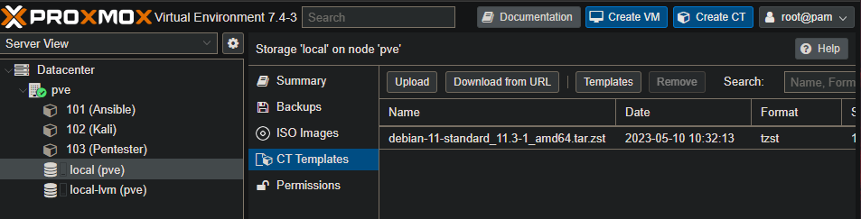
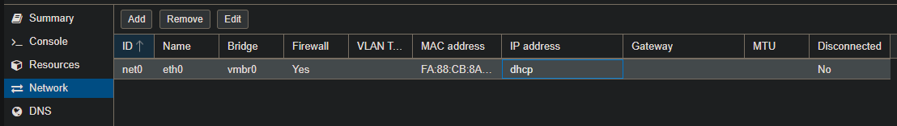
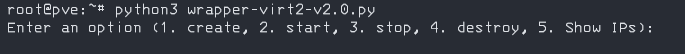
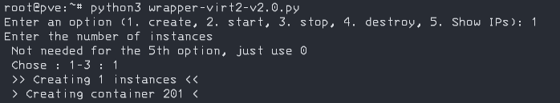
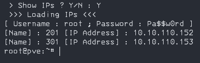
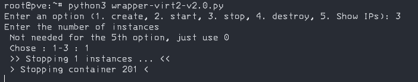
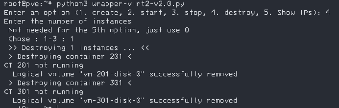

# VIRT-2

## Deliverable

Documentation, scripts on GitHub : https://github.com/CPNV-DGS-VIRT2/VIRT2

### Github

Here's how the GitHub is organized

```
.\README.md - This document
.\wrapper-virt2.py - Wrapper script to execute in the proxmox VM

.\ansible\ - Contains the playbooks and inventory files for each container

.\ansible\kali
	.\Execution-Kali.md - Command used to run the playbook
	.\kali.cfg - Inventory file for Kali container
	.\playbook-kali.yaml - Playbook for Kali container

.\ansible\pentester
	.\Execution-Pentester.md - Command used to run the playbook
	.\pentest.cfg - Inventory file for Pentester container
	.\playbook-pentest.yaml - Playbook for Pentester container

.\assets\ - Images of this documentation, automaticaly created by the Typora app
```


# Installation documentation

## Proxmox

> After testing with Proxmox and Docker, we found out that Proxmox with the LXC containers was easier to deploy and manage with the Cli.
>
> That's why this solution was chosen for this project.

##### Proxmox Installation

Download from the official website : [Get the free Proxmox VE ISO installer](https://www.proxmox.com/en/downloads/category/iso-images-pve)

##### Setup basic debian template



##### Configure DHCP Nat Network



Once we have our debian, we'll create a template with ssh installed.

### SSH

On the new container 

```markdown
apt update 
apt upgrade
```

Check if SSH Service is active

```
systemctl status ssh
```

Edit the **/etc/ssh/sshd_config** file to permit root login

```
PermitRootLogin yes
```

Convert to template once this is done

## Setup the Ansible Operator

Start with making a clone of the ssh template and apply the following commands to the new container

```
apt update && upgrade
apt install ansible
```

Ansible user created

```
name : ope
password : Pa$$w0rd
```

###### Optional Step

To make using Ansible a bit easier, we can setup ssh-keys once the other containers are created

```
#Generate a keypair on Ansible Container
ssh-keygen

#Copy the pub key to the ansible clients
ssh-copy-id admind@IPKali
ssh-copy-id admind@IPPentesterLab

#Remove passwords
admind ALL=(ALL) NOPASSWD:ALL >/etc/sudoers.d/admind_without_password

#/etc/ssh/sshd_config on the ansible clients
PermitRootLogin yes
PubkeyAuthentifcation yes
PermitEmptyPasswords yes
```

## Create Kali Template

> Kali container can also be referred as "Attacker" in this documentation

Clone the ssh template and create a new user with sudo rights

```
adduser admind ; Pa$$w0rd
usermod -aG sudo admind
```

### On the Ansible Operator

Create an inventory.cfg file and add the following

```
kaliIP ansible_user=admind
```

Next run the following playbook

Using the command : `ansible-playbook playbook-kali.yaml -i inventory.cfg`

```yaml
---
- hosts: all
  become: yes
  tasks:
    - name: update & upgrade
      apt:
        upgrade: yes
        update_cache: yes

    - name: enable Root Login
      lineinfile:
        dest: /etc/ssh/sshd_config
        regexp: '^PermitRootLogin'
        line: "PermitRootLogin yes"
        state: present
        backup: yes
      notify:
      - restart ssh

    - name: install nmap
      apt:
        name: nmap
        state: latest

    - name: install patator
      apt:
        name: patator
        state: latest

    - name: install crunch
      apt:
        name: crunch
        state: latest

    - name: install lynx
      apt:
        name: lynx
        state: latest

    - name: install weevely
      apt:
        name: weevely
        state: latest

    - name: install sqlmap
      apt:
        name: sqlmap
        state: latest

    - name: install nano
      apt:
        name: nano
        state: latest
```


## Create Pentester Lab Template

Clone the ssh template and create a new user with sudo rights

```
adduser admind ; Pa$$w0rd
usermod -aG sudo admind
```

### On the Ansible Operator

Edit the inventory.cfg file and add the following

```
pentesterlabIP ansible_user=admind
```

Next run the following playbook

Using the command : `ansible-playbook playbook-pentest.yaml -i inventory.cfg`

```yaml
---
- hosts: all
  become: yes
  tasks:
    - name: update & upgrade
      apt:
        upgrade: yes
        update_cache: yes

    - name: enable Root Login
      lineinfile:
        dest: /etc/ssh/sshd_config
        regexp: '^PermitRootLogin'
        line: "PermitRootLogin yes"
        state: present
        backup: yes
      notify:
      - restart ssh

    - name: install iptables
      apt:
        name: iptables
        state: latest

    - name: install apache2
      apt:
        name: apache2
        state: latest

    - name: install php
      apt:
        name: php
        state: latest

    - name: install pip3
      apt:
        name: python3-pip
        state: latest

    - name: install php-mysqli
      apt:
        name: php-mysqli
        state: latest
      notify:
      - restart apache2

    - name: install mariadb-server
      apt:
        name: mariadb-server
        state: latest

    - name: install git
      apt:
        name: git
        state: latest

    - name: Remove index.html page
      ansible.builtin.file:
        path: /var/www/html/index.html
        state: absent

    - name: Clone the photoblog
      ansible.builtin.git:
        repo: https://github.com/7ric/Photoblog.git
        dest: /var/www/html/
        update: no

    - name: Verify pymysql
      become: true
      pip:
        name: pymysql
        state: present

    - name: Create new database shop
      community.mysql.mysql_db:
        login_unix_socket: /var/run/mysqld/mysqld.sock
        state: import
        target: /var/www/html/photoblog.sql
        name: all
      ignore_errors: true

    - name: Change file permission
      file:
        path: /var/www/html/
        owner: www-data
        group: www-data
        recurse: true
        
    - name: display_errors on photoblog page
      lineinfile:
        dest: /etc/php/7.4/apache2/php.ini
        regexp: '^display_errors = Off'
        line: "display_errors = On"
        state: present
        backup: yes
        
    - name: disable_functions on php
      lineinfile:
        dest: /etc/php/7.4/apache2/php.ini
        regexp: '^disable_functions'
        line: "; disable_functions"
        state: present
        backup: yes
      notify:
      - restart apache2

  handlers:
    - name: restart ssh
      systemd:
        name: sshd
        state: restarted
    - name: restart apache2
      systemd:
        name: apache2
        state: restarted
```

> Convert to template or keep as container, doesn't matter do as you prefer
>
> Templates will take slightly less space on the lvm-local data.

## Wrapper LXC Script

> Python was used because of personal preference, since bash is less used

Installation on the Proxmox VM

```
apt install python3
```

Python 3.9.2 is installed on the proxmox for this.

#### Execution

> Copy the file or create new one on the Proxmox VM and copy the content
>
> - Copy : scp -rv C:\User\Auggus\Desktop\wrapper-virt2.py linux@10.10.110.131:/home
> - Create : nano wrapper-virt2.py -> Copy content from GitHub

```
python3 wrapper-virt2.py
```

##### wrapper-vrit2.py

```python
# Wrapper script made in the VIRT2 module - CPNV
# Goal : Manage Proxmox LXC Containers without using the Web Interface
# Version 2.0
# Author : David Varoso Gomes - SI-T1b

import os
import re

attacker = 102 # Template Attacker
pentest = 103 # Template Pentester Lab
# Index for cloned containers
index_attacker = 201 # Kali starts at 201
index_pentest = 301  # Pentest starts at 301
# Asking what the user wants to do with an input
user_option = input("Enter an option (1. create, 2. start, 3. stop, 4. destroy, 5. Show IPs): ") 
# Max 1-3 because of the proxmox configuration, the script can scale as high as you want
user_number = input("Enter the number of instances\n Not needed for the 5th option, just use 0 \n Chose : 1-3 : ") 
counter = int(user_number)

#Main function
def perform_action(option,number,attacker,pentest,index_attacker,index_pentest,counter):
    if option == "1":
        print(f" >> Creating {number} instances << ")
        # Perform create action here

        for id_attacker in range(index_attacker, index_attacker+int(counter)):
                print(f' > Creating container {id_attacker} < ')
                #print (f'pct clone {attacker} {id_attacker}')
                os.system(f'pct clone {attacker} {id_attacker}')

        for id_pentest in range(index_pentest, index_pentest+int(counter)):
                print(f' > Creating container {id_pentest} < ')
                #print (f'pct clone {pentest} {id_pentest}')
                os.system(f'pct clone {pentest} {id_pentest}')
        
        # Start after create feature
        user_option = input (" > Start created containers ? Y/N : ")
        start_after_create(user_option)
        user_ip = input (" > Show IPs ? Y/N : ")
        show_ip(user_ip)

    elif option == "2":
        print(f" >> Starting {number} instances ... << ")
        # Perform start action here

        for id_attacker in range(index_attacker, index_attacker+int(counter)):
                print(f' > Starting container {id_attacker} < ')
                #print (f'pct start {id_attacker}')
                os.system(f'pct start {id_attacker}')

        for id_pentest in range(index_pentest, index_pentest+int(counter)):
                print(f' > Starting container {id_pentest} < ')
                #print (f'pct start {id_pentest}')
                os.system(f'pct start {id_pentest}')

        user_ip = input (" > Show IPs ? Y/N : ")
        show_ip(user_ip)

    elif option == "3":
        print(f" >> Stopping {number} instances ... << ")
        # Perform stop action here

        for id_attacker in range(index_attacker, index_attacker+int(counter)):
                print(f' > Stopping container {id_attacker} < ')
                #print (f'pct stop {id_attacker}')
                os.system(f'pct stop {id_attacker}')

        for id_pentest in range(index_pentest, index_pentest+int(counter)):
                print(f' > Stopping container {id_pentest} < ')
                #print (f'pct stop {id_pentest}')
                os.system(f'pct stop {id_pentest}')

    elif option == "4":
        print(f" >> Destroying {number} instances ... << ")
        # Perform destroy action here

        for id_attacker in range(index_attacker, index_attacker+int(counter)):
                print(f' > Destroying container {id_attacker} < ')
                #print (f'pct destroy {id_attacker}')
                os.system(f'pct stop {id_attacker}')
                os.system(f'pct destroy {id_attacker}')

        for id_pentest in range(index_pentest, index_pentest+int(counter)):
                print(f' > Destroying container {id_pentest} < ')
                #print (f'pct destroy {id_pentest}')
                os.system(f'pct stop {id_pentest}')
                os.system(f'pct destroy {id_pentest}')
                
    elif option == "5":
        # Showing IPs on menu if it didn't work properly on the start
        print(' >>> Loading IPs <<< ')
        print(f"[ Username : root ; Password : Pa$$w0rd ]")
        output = os.popen('lxc-ls -f').read()
        pattern = r"(\S+)\s+RUNNING\s+\S+\s+-\s+(\S+)"
        matches = re.findall(pattern, output)
        for match in matches:
            container_name, ip_address = match
            print(f"[Name] : {container_name} [IP Address] : {ip_address}")
        
    else:
      print("Invalid option!")

#Function to show the IPs of the new containers and the login
def show_ip(ip):
    if ip == "Y":
        print(' >>> Loading IPs <<< ')
        print(f"[ Username : root ; Password : Pa$$w0rd ]")
        output = os.popen('lxc-ls -f').read()
        pattern = r"(\S+)\s+RUNNING\s+\S+\s+-\s+(\S+)"
        matches = re.findall(pattern, output)
        for match in matches:
            container_name, ip_address = match
            print(f"[Name] : {container_name} [IP Address] : {ip_address}")
    if ip == "N":
        print('Alright sure')

def start_after_create(option):
    if option == "Y":
      print (' >> Starting << ')
      
      for id_attacker in range(index_attacker, index_attacker+int(counter)):
        print(f' > Starting container {id_attacker} < ')
        #print (f'pct start {id_attacker}')
        os.system(f'pct start {id_attacker}')
      for id_pentest in range(index_pentest, index_pentest+int(counter)):
        print(f' > Starting container {id_pentest} < ')
        #print (f'pct start {id_pentest}')
        os.system(f'pct start {id_pentest}')
      
      if option == "N":
        print(' > You can also start them with the option 2 of the menu < ')

#Execution of the main function
perform_action(user_option,user_number,attacker,pentest,index_attacker,index_pentest,counter)
```

The script will guide you for most steps, here's a basic tutorial on how to use it.

The principal functions are :

- Create
- Start
- Stop
- Destroy

It will also ask how many instances you want to apply those functions to

> 1 instance means 2 containers for 1 student, 1 Kali and 1 Pentester

You can launch it from the following command : `python3 wrapper-virt2.py`

It will prompt witch option you want



Here we select, option 1 ; create and 1 instance



Once they are created, we can start them directly from the create command or with the 2nd option, start


It will ask to show the IPs of started containers



To stop we just select 3




Once they are stoped and we no longer need them, we can destroy the containers, we can also destroy them if they are running




A 5th option was also added to display the IP's and login of started containers, if missed during the start command.

# Possible Upgrades

This was designed to a max 3 instances demo, if we want to scale to a 20 student class some changes need to be done on the local-lvm storage.

For the script, it can technically scale to whatever the user wants since its loops and variables that are doing the work on Proxmox. Some changes could be made to make it more dynamic, like better options, some options repeat or show when they aren't needed (Example : If you Select 5 to Show IP's it still asks the instances, not needed for that command).

For the local-lvm storage, it would be best to create better template containers, that take less space than 4.29GB and to give more storage to the proxmox VM.

